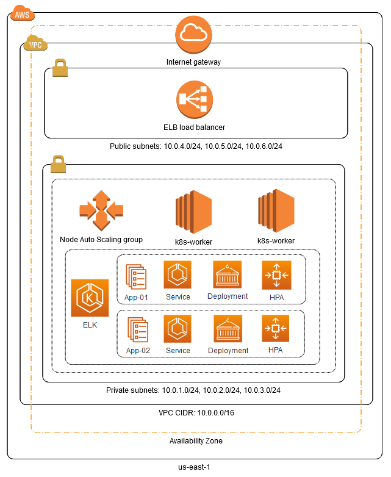

# Natura DevOps - Challenge
Pedro Veríssimo Dantas Neto (pedro@verissimo.net.br)

## Technologies Used in Challenge
1. terraform
    - Used to build and manage infrastructure like code
2. Amazon EKS (Elastic Kubernetes Service)
    - Cloud-based container management service that natively integrates with Kubernetes to deploy applications. 
3. helm
    - Package manager for Kubernetes that allows developers and operators to more easily package, configure, and deploy applications and services onto Kubernetes clusters.

## Accomplished integrations
1. AWS terraform provider
    - used to interact with the many resources supported by AWS like VPC, security groups and EC2.
2. Kubernetes terraform provider
    - Used to manage kubernetes resources, such as pods, services, policies, quotas and more.
3. helm terraform provider  
    - Used to deploy software packages in Kubernetes. Applying resources, replicas, autoscale and rollback strategies.

## For this challenge, you will need:
- An AWS account with the IAM permissions listed on the EKS module documentation,
- A configured AWS CLI
- AWS IAM Authenticator
- kubectl
- wget (required for the eks module)
- helm (required for deploy the applications)

## Configfure AWS CLI
```aws configure```

     AWS Access Key ID [None]: YOUR_AWS_ACCESS_KEY_ID
     AWS Secret Access Key [None]: YOUR_AWS_SECRET_ACCESS_KEY
     Default region name [None]: YOUR_AWS_REGION
     Default output format [None]: json

```git clone https://bitbucket.org/naturacode/devops/ && cd devops/```

## Architecture Designer ###



## List of files and their descriptions
1. [providers.tf](providers.tf) defines the providers configuration. 
2. [versions.tf](versions.tf) sets the Terraform version to at least 0.14. It also sets versions for the providers used in this challenge. 
3. [variables.tf](variables.tf) defines the variables.
4. [vpc.tf](vpc.tf) provisions a VPC, subnets and availability zones using the AWS VPC Module. 
5. [security-groups.tf](security-groups.tf) provisions the security groups used by the EKS cluster.
6. [eks-cluster-nodes.tf](eks-cluster-nodes.tf) provisions all the resources (AutoScaling Groups, etc...) required to set up an EKS cluster using the AWS EKS Module.
7. [outputs.tf](outputs.tf) defines the output configuration.
8. [app-01.tf](app-01.tf) defines the deployment of app-01 with Replicas, Resources and Autoscale.
9. [app-02.tf](app-02.tf) defines the deployment of app-02 with Replicas, Resources and Autoscale.

## Initialize Terraform workspace
```terraform init```
## Provision the EKS cluster
```terraform apply -auto-approve```
### Configure kubectl
```aws eks --region $(terraform output -raw region) update-kubeconfig --name $(terraform output -raw cluster_name)```

### Get info of the nodes
```kubectl get nodes```

### Get info of the cluster
```kubectl cluster-info```

## Get the app URL
### App-01 URL access test
```curl http://$(kubectl get service -n app-01 -o jsonpath='{.items[*].status.loadBalancer.ingress[*].hostname}')```

### App-02 URL access test 
```curl http://$(kubectl get service -n app-02 -o jsonpath='{.items[*].status.loadBalancer.ingress[*].hostname}')```

## Check the Horizontal Pod Autoscaler
### Check the CPU autoscale in the App-01
```kubectl get hpa -n app-01```

### Check the memory autoscale in the App-02
```kubectl get hpa -n app-02```

## Check App version and Rollback version
### Check App version
```helm ls -n app-01```

```helm ls -n app-02```

### Rolling back the application
```helm rollback nginx 5 -n app-01```

```helm rollback wordpress 5 -n app-02```
